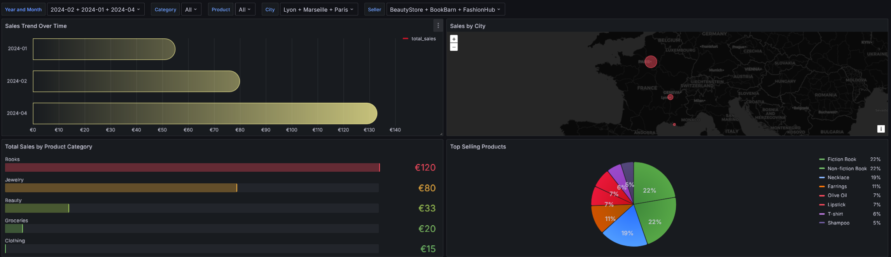

# Grafana Docker Setup

This Docker Compose configuration sets up a Grafana environment to provision a dashboard for visualizing data from the MySQL data source.

Start the Grafana service with:

```bash
docker-compose up -d
```

Access Grafana at `http://localhost:3000`. Add the MySQL data source and import the `Dashboard-test.json` to start visualizing the data.

## Environment Variables

Create a `.env` file with the following content:

```
GF_SECURITY_ADMIN_USER=admin
GF_SECURITY_ADMIN_PASSWORD=test
```

Modify these variables according to your configuration.

## Dashboard Provisioning

Here’s a quick overview of the provided `Dashboard-test.json` in the `dashboards` directory:

- **Data Source:** MySQL
- **Panels:**
  - **Bar Chart:** Sales Trend Over Time
  - **Geo Map:** Sales by City
  - **Bar Gauge:** Total Sales by Product Category
  - **Pie Chart:** Top Selling Products
  - **Bar Chart:** Seller Perfomance 

## Example Dashboards

To visualize the data, import the `Dashboard-test.json` file in Grafana after setting up the MySQL data source.



